# Logical ERD for Clinic Recording System

## Entity Relationship Diagram

```mermaid
erDiagram
    %% Core User Management
    tbl_users {
        int user_id PK
        varchar name
        varchar email
        varchar password
        int role_id FK
        boolean must_change_password
        boolean is_active
        timestamp created_at
    }
    
    tbl_roles {
        int role_id PK
        varchar role_name
    }
    
    %% User Role Extensions
    tbl_patients {
        int patient_id PK
        int user_id FK
        varchar sex
        varchar contact_num
        date birthdate
        int age
        text address
        timestamp created_at
        timestamp updated_at
    }
    
    tbl_doctors {
        int doctor_id PK
        int user_id FK
        varchar license_number
        int specialization_id FK
        int years_experience
        timestamp created_at
        timestamp updated_at
    }
    
    tbl_nurses {
        int nurse_id PK
        int user_id FK
        varchar license_number
        varchar shift_schedule
        timestamp created_at
        timestamp updated_at
    }
    
    tbl_secretaries {
        int secretary_id PK
        int user_id FK
        varchar employee_id
        timestamp created_at
        timestamp updated_at
    }
    
    %% Reference Data
    tbl_specializations {
        int specialization_id PK
        varchar name
        text description
    }
    
    tbl_status_type {
        int status_type_id PK
        varchar status_type_name
    }
    
    tbl_status {
        int status_id PK
        int status_type_id FK
        varchar status_name
    }
    
    %% Appointment System
    tbl_appointment_reasons {
        int reason_id PK
        varchar reason_name
        text description
        boolean is_active
        timestamp created_at
    }
    
    tbl_appointments {
        int appointment_id PK
        int patient_id FK
        int doctor_id FK
        int nurse_id FK
        int secretary_id FK
        date appointment_date
        int queue_number
        int status_id FK
        int appointment_reason_id FK
        text appointment_notes
        timestamp created_at
        timestamp updated_at
    }
    
    %% Queue Management
    tbl_current_queue {
        int queue_id PK
        date date
        int current_appointment_id FK
        int next_appointment_id FK
        int last_updated_by FK
        timestamp last_updated_at
    }
    
    tbl_doctor_queue {
        int queue_id PK
        int appointment_id FK
        int doctor_id FK
        enum status
        timestamp assigned_at
        timestamp started_at
        timestamp completed_at
        text notes
    }
    
    tbl_nurse_queue {
        int queue_id PK
        int appointment_id FK
        int nurse_id FK
        enum status
        timestamp assigned_at
        timestamp started_at
        timestamp completed_at
        text notes
    }
    
    %% Medical Records
    tbl_conditions {
        int condition_id PK
        varchar condition_name
        timestamp created_at
    }
    
    tbl_illnesses {
        int illness_id PK
        varchar illness_name
        timestamp created_at
    }
    
    tbl_consultations {
        int consultation_id PK
        int appointment_id FK
        int doctor_id FK
        int nurse_id FK
        int patient_id FK
        varchar diagnosis
        text consultation_notes
        date next_appointment_date
        text next_appointment_notes
        enum consultation_status
        timestamp nurse_completed_at
        boolean patient_ready_for_doctor
        text nurse_notes
        int illness_id FK
        int condition_id FK
        timestamp created_at
        timestamp updated_at
    }
    
    %% Consultation Details
    tbl_consultation_history {
        int consultation_id PK
        text present_illness
        text past_medical_history
        text past_surgical_history
        text family_history
        text social_history
        text current_medications
        text nurse_assessment
        text chief_complaint
        timestamp created_at
        timestamp updated_at
    }
    
    tbl_consultation_vitals {
        int consultation_id PK
        decimal height_cm
        decimal weight_kg
        varchar blood_pressure_mmHg
        int heart_rate_bpm
        decimal spo2_percent
        decimal temperature_celsius
        timestamp created_at
        timestamp updated_at
    }
    
    tbl_consultation_lifestyle {
        int lifestyle_id PK
        int consultation_id FK
        enum smoking_status
        varchar smoking_packs_per_day
        enum alcohol_use
        varchar alcohol_frequency
        enum sexual_activity
        timestamp created_at
        timestamp updated_at
    }
    
    tbl_consultation_summary {
        int consultation_id PK
        text symptoms_text
        varchar final_diagnosis
        timestamp created_at
        timestamp updated_at
    }
    
    %% Laboratory System
    tbl_lab_test_types {
        int lab_test_type_id PK
        varchar type_name
        text description
        decimal price
        timestamp created_at
        timestamp updated_at
    }
    
    tbl_lab_requests {
        int lab_request_id PK
        int consultation_id FK
        int doctor_id FK
        int secretary_id FK
        int patient_id FK
        int appointment_id FK
        int lab_test_type_id FK
        text request_text
        int status_id FK
        timestamp created_at
        timestamp updated_at
    }
    
    tbl_lab_results {
        int result_id PK
        int lab_request_id FK
        int patient_id FK
        int doctor_id FK
        varchar result_file
        text result_text
        int uploaded_by FK
        int status_id FK
        timestamp uploaded_at
    }
    
    %% Medicine Management
    tbl_medicine_generic_names {
        int generic_id PK
        varchar generic_name
        text description
        timestamp created_at
        timestamp updated_at
    }
    
    tbl_medicine_forms {
        int form_id PK
        varchar form_name
    }
    
    tbl_medicines {
        int medicine_id PK
        int generic_id FK
        varchar strength
        int form_id FK
        decimal price
        timestamp created_at
        timestamp updated_at
    }
    
    tbl_prescriptions {
        int prescription_id PK
        int consultation_id FK
        int appointment_id FK
        int doctor_id FK
        int patient_id FK
        int medicine_id FK
        varchar dosage
        varchar frequency
        varchar duration
        int quantity
        varchar packaging_unit
        int packaging_unit_id FK
        text instructions
        enum status
        timestamp created_at
        timestamp updated_at
    }
    
    %% Payment System
    tbl_payment_methods {
        int method_id PK
        varchar method_name
        text description
        boolean is_active
        timestamp created_at
        timestamp updated_at
    }
    
    tbl_payments {
        int payment_id PK
        int appointment_id FK
        int patient_id FK
        decimal amount
        enum payment_method
        int status_id FK
        datetime payment_date
        timestamp created_at
        timestamp updated_at
    }
    
    tbl_payment_references {
        int ref_id PK
        int payment_id FK
        varchar method_name
        varchar payer_account
        timestamp created_at
    }
    
    %% Relationships
    tbl_users ||--o{ tbl_patients : "has"
    tbl_users ||--o{ tbl_doctors : "has"
    tbl_users ||--o{ tbl_nurses : "has"
    tbl_users ||--o{ tbl_secretaries : "has"
    
    tbl_roles ||--o{ tbl_users : "defines"
    tbl_specializations ||--o{ tbl_doctors : "specializes_in"
    
    tbl_status_type ||--o{ tbl_status : "categorizes"
    
    tbl_patients ||--o{ tbl_appointments : "books"
    tbl_doctors ||--o{ tbl_appointments : "assigned_to"
    tbl_nurses ||--o{ tbl_appointments : "assigned_to"
    tbl_secretaries ||--o{ tbl_appointments : "manages"
    tbl_appointment_reasons ||--o{ tbl_appointments : "categorizes"
    tbl_status ||--o{ tbl_appointments : "tracks"
    
    tbl_appointments ||--o{ tbl_consultations : "results_in"
    tbl_doctors ||--o{ tbl_consultations : "conducts"
    tbl_nurses ||--o{ tbl_consultations : "assists"
    tbl_patients ||--o{ tbl_consultations : "participates_in"
    tbl_conditions ||--o{ tbl_consultations : "diagnosed_as"
    tbl_illnesses ||--o{ tbl_consultations : "suffers_from"
    
    tbl_consultations ||--|| tbl_consultation_history : "has"
    tbl_consultations ||--|| tbl_consultation_vitals : "records"
    tbl_consultations ||--o{ tbl_consultation_lifestyle : "assesses"
    tbl_consultations ||--|| tbl_consultation_summary : "summarizes"
    
    tbl_consultations ||--o{ tbl_lab_requests : "requests"
    tbl_doctors ||--o{ tbl_lab_requests : "orders"
    tbl_secretaries ||--o{ tbl_lab_requests : "processes"
    tbl_patients ||--o{ tbl_lab_requests : "for"
    tbl_appointments ||--o{ tbl_lab_requests : "related_to"
    tbl_lab_test_types ||--o{ tbl_lab_requests : "specifies"
    tbl_status ||--o{ tbl_lab_requests : "tracks"
    
    tbl_lab_requests ||--o{ tbl_lab_results : "produces"
    tbl_patients ||--o{ tbl_lab_results : "belongs_to"
    tbl_doctors ||--o{ tbl_lab_results : "reviewed_by"
    tbl_users ||--o{ tbl_lab_results : "uploaded_by"
    tbl_status ||--o{ tbl_lab_results : "tracks"
    
    tbl_medicine_generic_names ||--o{ tbl_medicines : "generic_for"
    tbl_medicine_forms ||--o{ tbl_medicines : "form_of"
    
    tbl_consultations ||--o{ tbl_prescriptions : "prescribes"
    tbl_appointments ||--o{ tbl_prescriptions : "related_to"
    tbl_doctors ||--o{ tbl_prescriptions : "writes"
    tbl_patients ||--o{ tbl_prescriptions : "prescribed_to"
    tbl_medicines ||--o{ tbl_prescriptions : "prescribes"
    
    tbl_appointments ||--o{ tbl_payments : "requires"
    tbl_patients ||--o{ tbl_payments : "makes"
    tbl_status ||--o{ tbl_payments : "tracks"
    
    tbl_payments ||--o{ tbl_payment_references : "references"
    
    tbl_appointments ||--o{ tbl_current_queue : "queued_in"
    tbl_appointments ||--o{ tbl_doctor_queue : "assigned_to_doctor"
    tbl_appointments ||--o{ tbl_nurse_queue : "assigned_to_nurse"
```

## Key Relationships Summary

### Core User Management
- **tbl_users** is the central user table with role-based access
- **tbl_roles** defines user types (secretary, doctor, patient, nurse)
- Each role has its own extension table (patients, doctors, nurses, secretaries)

### Appointment Flow
1. **tbl_appointments** - Core appointment entity
2. **tbl_consultations** - Medical consultation records
3. **tbl_prescriptions** - Medication prescriptions
4. **tbl_lab_requests** & **tbl_lab_results** - Laboratory workflow
5. **tbl_payments** - Payment processing

### Queue Management
- **tbl_current_queue** - Tracks current queue state
- **tbl_doctor_queue** & **tbl_nurse_queue** - Role-specific queue management

### Medical Records
- **tbl_consultation_history** - Patient medical history
- **tbl_consultation_vitals** - Vital signs recording
- **tbl_consultation_lifestyle** - Lifestyle assessment
- **tbl_consultation_summary** - Consultation summary

### Medicine Management
- **tbl_medicine_generic_names** - Generic medicine names
- **tbl_medicine_forms** - Medicine forms (tablet, capsule, etc.)
- **tbl_medicines** - Specific medicine instances
- **tbl_prescriptions** - Prescription records

### Status Management
- **tbl_status_type** - Categories of statuses (Appointment, Payment, LabResult)
- **tbl_status** - Specific status values

This logical ERD focuses on the core business entities and their relationships, excluding unnecessary technical attributes like timestamps and auto-increment fields for clarity.
